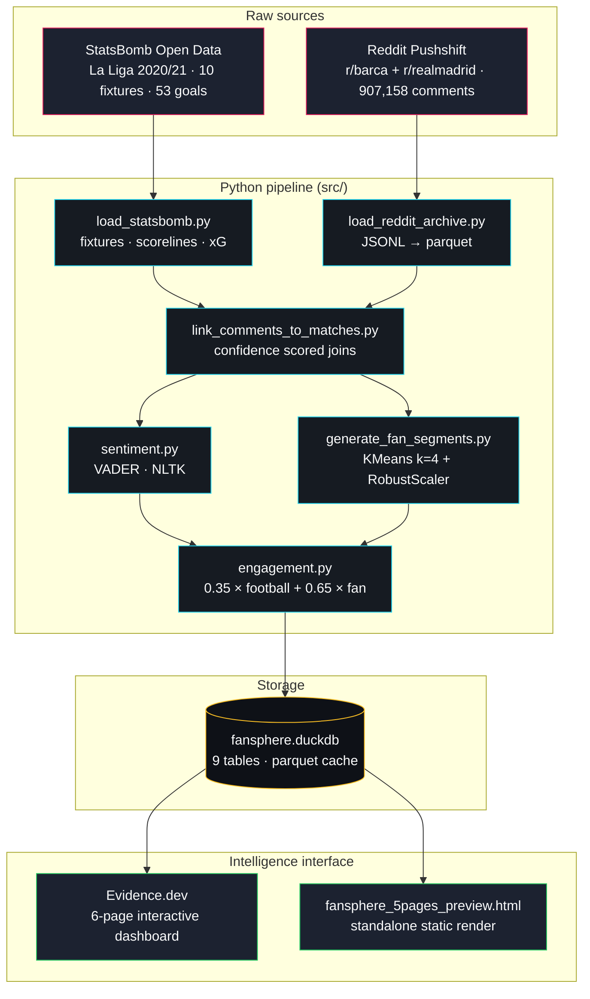

# FanSphere AI

> Football audience intelligence system. 907K fan comments cross-referenced against 10 La Liga fixtures to separate engagement volume from engagement intensity.


FanSphere AI investigates how football matches move fan communities. It joins on-pitch event data (StatsBomb) with subreddit conversation (Reddit), scores sentiment at comment level, segments authors into behavioural cohorts, and produces a composite engagement signal that decouples raw volume from emotional intensity.

**Headline finding:** weighting fan reaction over goal count lifts El Clásico to **#1** on combined engagement. But raw volume still isn't the same as rank: the single highest-volume fixture in the dataset (17,089 comments) sits at #5, dragged down by a low scoreline. Volume, fan affect, and on-pitch excitement are three distinct axes.

---

## 📦 Deliverables

Direct links to the main parts of the repo:

- 📑 **[Full PDF Report](docs/FanSphere_AI_Report.pdf)** · v1.1 technical report (architecture, methodology, results)
- 📊 **[Live dashboard preview](https://htmlpreview.github.io/?https://github.com/Prashant-upadhyay-Projects/FanSphere-AI/blob/master/dashboard/fansphere_5pages_preview.html)** · standalone static render of all pages, no install
- 📈 **[Evidence dashboard source](dashboard/app)** · 6-page interactive dashboard (`.md` + SQL)
- 🧪 **[AutoResearch framework](Autoresearch_fansphere)** · the autonomous experiment loop that tuned v1.1
- 📄 **[AutoResearch report](Autoresearch_fansphere/RESEARCH_REPORT.md)** · methodology + per-experiment results
- 🗒️ **[What's New (v1.1)](dashboard/app/pages/changelog.md)** · before/after change receipts
- 🐍 **[Pipeline source](src)** · ingestion → linking → sentiment → segmentation → scoring
- 📓 **[Stage 3 notebook](notebooks/stage3_audience_sentiment.ipynb)** · the analysis walkthrough
- 🏗️ **[Architecture diagram](architecture.mmd)** · the full data flow

---

## Why It Exists

Commercial and content teams at top clubs consume the same primitives: who is engaging, when, how strongly, and against which fixture. This system implements those primitives on open data. It doubles as a reference architecture for fan behavioural intelligence and a research probe into whether on-pitch events causally drive online fan affect or merely correlate with it.

---

## System Architecture



---

## Pipeline Components

| Module | Responsibility |
|---|---|
| `load_statsbomb.py` | Fixture ingestion, rivalry tagging, xG |
| `load_reddit_archive.py` | Pushshift JSONL → parquet (907K comments) |
| `link_comments_to_matches.py` | Confidence scored comment-to-fixture joins (threshold 0.40) |
| `sentiment.py` | VADER compound scoring per comment |
| `generate_fan_segments.py` | KMeans k=4 + RobustScaler author cohorts (silhouette 0.64) |
| `engagement.py` | Composite score: `0.35 × football_norm + 0.65 × fan_blend` |
| `build_dashboard_db.py` | Loads `outputs/` into the Evidence DuckDB (reproducible) |

Core logic lives in [`src/engagement.py`](src/engagement.py) and [`src/link_comments_to_matches.py`](src/link_comments_to_matches.py).

---

## Key Findings

| Fixture | Goals | Combined | Fan Score |
|---|---|---|---|
| El Clásico · Barcelona 1–3 Real Madrid | 4 | **0.598** | **0.681** |
| Real Sociedad 1–6 Barcelona | 7 | 0.597 | 0.380 |
| Levante 3–3 Barcelona | 6 | 0.558 | 0.500 |
| Barcelona 5–2 Real Betis | 7 | 0.527 | 0.272 |
| El Clásico · Real Madrid 2–1 Barcelona | 3 | 0.435 | **0.609** |

The October El Clásico ranks **#1**. It carries the highest fan-affect score in the dataset (0.681), and the fan-biased blend rewards that. The April Clásico drew the **most comments of any fixture (17,089)** yet ranks #5: a 3-goal match scores low on the on-pitch axis, and combined engagement still respects both signals. The volume-vs-intensity divergence that motivated the project now reads on the dashboard's divergence chart instead of being buried in the headline ranking.

---

## v1.1: Tuned by AutoResearch

Two modelling choices in v1.0 were unvalidated defaults: `k=3` clustering and a `0.5 / 0.5` engagement blend. v1.1 replaced them with results from an autonomous experiment loop, a Karpathy-style ratchet that proposes one change, tests it against a label-grounded metric, keeps only strict improvements, and logs everything. Nine experiments ran. Two changes shipped, one was a deliberate null result.

| Decision | v1.0 | v1.1 | Result |
|---|---|---|---|
| Author clustering | KMeans k=3, StandardScaler | KMeans k=4, **RobustScaler** | silhouette **0.40 → 0.64**, surfaced an "Ultra" power-user cohort |
| Engagement blend | 0.5 / 0.5 (football / fan) | **0.35 / 0.65** | El Clásico **#4 → #1**, rivalry-vs-rest separation (AUC) **0.50 → 0.81** |
| Sentiment model | VADER, mean | *unchanged* | All 6 VADER/TextBlob × aggregation combos tested, hit a ceiling. Sentiment proven *not* the bottleneck |

The metric was grounded in labels already in the data (`is_rivalry`, `total_goals`), so no hand-labelling was required. The loop, its frozen evaluator, a Pro-plan usage guardrail, a graduation kill-switch, and the per-experiment audit trail live in [`Autoresearch_fansphere/`](Autoresearch_fansphere/) (start with its `RESEARCH_REPORT.md`). The dashboard's "What's New" page carries the same receipts.

---

## Research Questions

The system was designed around four open questions:

1. Does rivalry sentiment correlate with match intensity, or do they operate on independent axes?
2. Can subreddit behavioural signatures predict post-match engagement before kickoff?
3. How does fan cohort composition shift across fixture types (rivalry vs. routine)?
4. What is the marginal effect of an additional goal on combined engagement score?

Findings so far suggest questions 1 and 4 have cleaner answers than 2 and 3. The latter two remain active areas of extension.

---

## Quick Start

```bash
git clone https://github.com/Prashant-upadhyay-Projects/FanSphere-AI.git
cd FanSphere-AI
python -m venv .venv && source .venv/bin/activate   # Windows: .venv\Scripts\activate
pip install -r requirements.txt

# Stages 1 and 2: StatsBomb pipeline
python main.py --skip-reddit --no-persist

# Stage 3: sentiment, segmentation, engagement (v1.1 configs live in the code)
python -m src.load_reddit_archive --input data/raw/reddit --output data/interim/reddit_comments.parquet
jupyter nbconvert --to notebook --execute --inplace notebooks/stage3_audience_sentiment.ipynb
python -m src.generate_fan_segments          # author cohorts (k=4 + RobustScaler)
python -m src.build_dashboard_db             # load outputs/ into the dashboard DuckDB

# Intelligence interface
cd dashboard/app && npm install && npm run sources && npm run dev
```

No Reddit data? **[Open the live dashboard preview →](https://htmlpreview.github.io/?https://github.com/Prashant-upadhyay-Projects/FanSphere-AI/blob/master/dashboard/fansphere_5pages_preview.html)** is a standalone static render, no install required.

Copy `.env.example` → `.env` and populate credentials before running the pipeline.

---

## Stack

`Python` · `pandas` · `VADER / NLTK` · `scikit-learn` · `DuckDB` · `Evidence.dev` · `ECharts`

---

## Future Direction

1. Replace VADER with a football-domain transformer. v1.1 tested VADER vs TextBlob and three aggregation schemes and hit a ceiling, so the next gain has to come from a domain-tuned model, not the lexicon.
2. Expand across multiple seasons and competitions (UCL, Premier League). The current 10-fixture window makes statistical claims descriptive, not population-level.
3. Live ingestion via Reddit API with fixture-aware temporal windowing.
4. Probabilistic match state modelling driven by xG timelines.
5. Cohort stability analysis across consecutive seasons to measure fan drift.

---

## License

MIT, see [`LICENSE`](LICENSE).
StatsBomb data: [StatsBomb Open Data license](https://github.com/statsbomb/open-data#license) (non-commercial use, attribution required).
Reddit content: sourced from public Pushshift archives for analytical use only.
