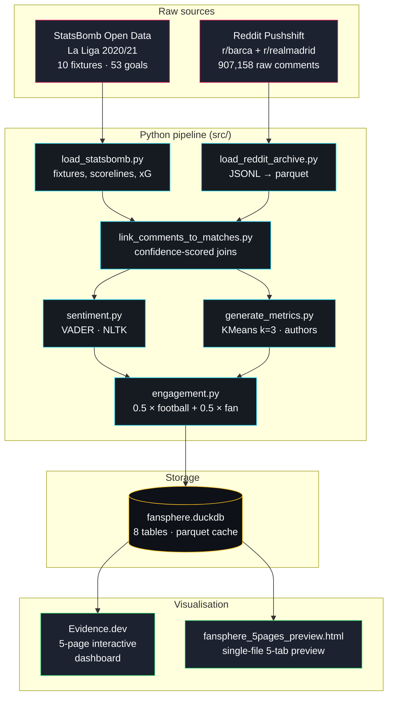

# FanSphere AI

> **Football fan engagement intelligence — built on 907K Reddit comments, 10 La Liga fixtures, and the El Clásico paradox.**


FanSphere AI is a reference implementation of the behavioural-intelligence stack a modern football club's commercial and content teams actually use — distilled down to a portfolio-friendly footprint, built end to end on open data.

It ingests on-pitch event data (StatsBomb) and fan conversation (Reddit), scores sentiment per comment, segments authors into behavioural cohorts (KMeans), computes a composite engagement score, and serves the results through an interactive Evidence.dev dashboard plus a single-file HTML preview.

The headline finding it surfaces: **El Clásico generates the largest fan volume but doesn't rank highest on combined engagement** — because volume and excitement aren't the same signal.

---

## Table of contents

- [What this project demonstrates](#what-this-project-demonstrates)
- [Architecture](#architecture)
- [Quick start](#quick-start)
- [Key results](#key-results)
- [Tech stack](#tech-stack)
- [Project structure](#project-structure)
- [The dashboard](#the-dashboard)
- [Methodology in 60 seconds](#methodology-in-60-seconds)
- [Deeper reading](#deeper-reading)
- [License & acknowledgements](#license--acknowledgements)

---

## What this project demonstrates

Modern football clubs are media networks. Their commercial, marketing, content, and CRM teams all consume the same primitives: who is engaging, when, how strongly, and how that maps to specific fixtures or moments. FanSphere AI implements those primitives end to end:

| Capability | Where it lives in the repo | Buyer / consumer in the real world |
|---|---|---|
| Audience intelligence | `src/engagement.py`, `match_sentiment` table | Sponsorship, broadcast, CRM |
| Fan engagement scoring | Composite score in `engagement.py` | Content cadence, social, commercial |
| Cohort segmentation | `src/generate_metrics.py` (KMeans k=3) | Activation targeting, retention |
| Comment-to-match linking | `src/link_comments_to_matches.py` | Sentiment-on-fixture reporting |
| Per-fixture rankings | `ranking` view + Evidence pages | Executive review, sales narratives |

If you came here to evaluate the code: jump to [`src/engagement.py`](src/engagement.py) and [`src/link_comments_to_matches.py`](src/link_comments_to_matches.py). They carry the load.

---

## Architecture



Standalone source: [`architecture.mmd`](architecture.mmd). Render with the Mermaid CLI or [mermaid.live](https://mermaid.live) for SVG/PNG export.

---

## Quick start

```bash
# 1. Clone & enter
git clone https://github.com/<your-user>/FanSphere-AI.git
cd FanSphere-AI

# 2. Python environment + ETL deps
python -m venv .venv
source .venv/bin/activate          # Windows: .venv\Scripts\activate
pip install -r requirements.txt

# 3. Re-run the pipeline (optional — DuckDB is committed)
python main.py --skip-reddit --no-persist            # Stages 1 & 2
python -m src.load_reddit_archive \
        --input data/raw/reddit \
        --output data/interim/reddit_comments.parquet
jupyter nbconvert --to notebook --execute --inplace \
        notebooks/stage3_audience_sentiment.ipynb     # Stage 3

# 4. Launch the dashboard
cd dashboard/app
npm install
npm run sources                    # builds parquet cache from fansphere.duckdb
npm run dev                        # opens http://localhost:3000
```

Want to see it without installing anything? Open [`dashboard/fansphere_5pages_preview.html`](dashboard/fansphere_5pages_preview.html) directly in any browser — it's a self-contained 5-tab static render of the live dashboard.

---

## Key results

**Top 5 fixtures by combined engagement** *(½ × on-pitch normalised + ½ × fan-side blend)*:

| # | Fixture | Score | Goals | Combined | Fan score | Notes |
|---|---|---|---|---|---|---|
| 1 | Real Sociedad vs Barcelona | 1–6 | 7 | **0.690** | 0.380 | Goal-fest blowout |
| 2 | Barcelona vs Real Betis | 5–2 | 7 | **0.636** | 0.272 | Same story |
| 3 | Levante UD vs Barcelona | 3–3 | 6 | **0.583** | 0.500 | High fan engagement |
| 4 | Barcelona vs Real Madrid | 1–3 | 4 | **0.563** | 0.681 | ⚔ Clásico — fan signal off the charts |
| 5 | Barcelona vs Deportivo Alavés | 5–1 | 6 | **0.419** | 0.172 | |

**The El Clásico paradox**:
- 17,089 comments on Real Madrid 2–1 Barcelona (April 2021) → highest raw volume in the dataset, ranked **#7 of 10** on combined score because the match only had 3 goals.
- The volatility analysis shows rivalry matches generate the most argumentative fanbases regardless of result — that's the signal sponsors and broadcasters actually care about.

Full ranking, divergence chart, and the per-match drill-down all live in the dashboard.

---

## Tech stack

| Layer | Tooling | Why this and not something else |
|---|---|---|
| Ingestion | `requests`, Pushshift JSONL archives | StatsBomb has an official Python client; Pushshift archives sidestep Reddit API rate limits |
| Transform | `pandas`, `numpy`, `pyarrow` | Standard. Parquet keeps the 907K-comment file at ~10 MB |
| Sentiment | `vaderSentiment` (NLTK) | Lexicon-based, tuned for social text, no training data needed |
| Clustering | `scikit-learn` KMeans (k=3) | Three clusters fall out cleanly (silhouette 0.40); interpretable as personas |
| Storage | DuckDB (`fansphere.duckdb`) | Single-file analytical DB — no Postgres setup, runs offline, ships in the repo |
| Dashboard (primary) | [Evidence.dev](https://evidence.dev) | Markdown + SQL pages, native chart components, hot reload — exactly what an analytics engineer wants |
| Dashboard (preview) | Single-file HTML + [ECharts](https://echarts.apache.org) | No build step required for reviewers, mirrors all 5 Evidence pages |
| Visualisation theme | Dark canvas, crimson rivalry accent, cyan section headings | Designed for a portfolio-piece feel; theming lives in `evidence.config.yaml` |

---

## Project structure

```
FanSphere-AI/
├── README.md                       ← you are here
├── LICENSE                         ← MIT
├── architecture.mmd                ← Mermaid diagram source
├── FUTURE_SCOPE.md                 ← roadmap, commercial use cases, research
│
├── main.py                         ← CLI entrypoint for Stages 1 + 2
├── requirements.txt
├── .env.example
│
├── config/
│   └── team_aliases.yaml           ← 21 teams, 7 rivalries, subreddit priors
│
├── src/                            ← Python pipeline
│   ├── load_statsbomb.py           ← StatsBomb fetch + rivalry tagging
│   ├── load_reddit_archive.py      ← Pushshift JSONL → parquet
│   ├── link_comments_to_matches.py ← confidence-scored linker
│   ├── sentiment.py                ← VADER abstract + impl
│   ├── engagement.py               ← per-match composite score
│   ├── generate_metrics.py         ← KPIs + KMeans segmentation
│   └── db_loader.py                ← optional Postgres upserts
│
├── notebooks/
│   ├── 00_setup.ipynb
│   ├── 01_statsbomb_test.ipynb
│   └── stage3_audience_sentiment.ipynb   ← end-to-end Stage 3
│
├── data/                           ← raw + interim (git-ignored)
│   ├── raw/reddit/                 ← source Reddit comments
│   └── interim/reddit_comments.parquet
│
├── outputs/                        ← CSV/parquet artefacts (git-ignored)
│
├── sql/
│   └── schema.sql                  ← optional Postgres warehouse
│
└── dashboard/
    ├── app/                        ← Evidence.dev project (live dashboard)
    │   ├── pages/                  ← 5 markdown pages
    │   │   ├── index.md            ← Executive Overview
    │   │   ├── segments.md         ← The Tribes
    │   │   ├── match.md            ← The Match Lens
    │   │   ├── sentiment.md        ← The Mood Curve
    │   │   └── methodology.md      ← The Receipts
    │   ├── sources/fansphere/      ← DuckDB + SQL source connectors
    │   └── evidence.config.yaml    ← theme + appearance
    │
    ├── fansphere_5pages_preview.html  ← single-file static preview
    └── powerbi_guide.md            ← (legacy) Power BI build instructions
```

---

## The dashboard

Five pages, each pursuing a single question:

| Page | Sidebar label | Question it answers |
|---|---|---|
| 1 | Executive Overview | Which fixtures actually mattered — and how do raw volume and combined engagement diverge? |
| 2 | The Tribes | What kinds of fans show up? How concentrated is the conversation? |
| 3 | The Match Lens | For a given match, how did 90 minutes of football move 14,000 fans minute by minute? |
| 4 | The Mood Curve | How does the season's sentiment arc look — and where do the arguments live? |
| 5 | The Receipts | What's actually in the pipeline? Models, weights, caveats, reproducibility steps. |

Page ordering is enforced via `sidebar_position` frontmatter (see [Evidence's sidebar logic](https://docs.evidence.dev/markdown/frontmatter/)).

The standalone HTML preview mirrors all five pages as tabs in a single file — useful for sending to reviewers who don't want to run `npm install`.

---

## Methodology in 60 seconds

1. **Match data** — StatsBomb open data for La Liga 2020/21 Barcelona fixtures + both El Clásicos (10 matches, 53 goals with xG).
2. **Fan comments** — Pushshift JSONL archives for `r/barca` + `r/realmadrid`, filtered to a ±48-hour window around kickoff (907,158 raw → 93,298 linked).
3. **Linking** — rule-based, confidence-scored. Components: both-teams-mentioned (0.60), single team (0.35), rivalry keyword (0.25), home-team subreddit (0.25). Min threshold 0.40, fully auditable.
4. **Sentiment** — VADER compound score per comment. Labels at ±0.05 thresholds.
5. **Segmentation** — KMeans k=3 over standardised author features (comment frequency, matches covered, avg sentiment, volatility, positive ratio). Silhouette 0.40, three interpretable personas.
6. **Composite score** — 0.5 × football_norm + 0.5 × fan_engagement. Fan side is 0.40·volume + 0.25·affect + 0.20·volatility + 0.15·reach (all normalised 0–1).

The full rationale — why VADER over a transformer, why k=3 over k=5, why a 4-hour aggregation window — is summarised throughout the dashboard's *Receipts* page (`dashboard/app/pages/methodology.md`).

---

## Deeper reading

| Doc | When to read it |
|---|---|
| [FUTURE_SCOPE.md](FUTURE_SCOPE.md) | Technical roadmap, commercial use cases, research extensions |
| [`dashboard/HANDOFF.md`](dashboard/HANDOFF.md) | Dashboard build context |
| [`dashboard/powerbi_guide.md`](dashboard/powerbi_guide.md) | Legacy — pre-Evidence Power BI build instructions |

---

## Contributing

This started as a portfolio piece, but contributions are welcome. The cleanest extension paths:

- Adding a new sentiment model — drop a class implementing the `SentimentAnalyzer` ABC in `src/sentiment.py`.
- Adding a new data source — implement `BaseRedditConnector.iter_comments()` in `src/load_reddit_archive.py`.
- Adding a new Evidence page — drop a markdown file in `dashboard/app/pages/` with `sidebar_position` set.

Open an issue first if the change is non-trivial.

---

## License & acknowledgements

Code: **MIT** — see [`LICENSE`](LICENSE).

Data:
- StatsBomb data is provided under the [StatsBomb Open Data license](https://github.com/statsbomb/open-data#license) — free for non-commercial use with attribution.
- Reddit content is sourced from public Pushshift archives; the project respects Reddit's [API terms](https://www.redditinc.com/policies/data-api-terms) and only stores text content for analytical use.

Built with: [Evidence.dev](https://evidence.dev), [DuckDB](https://duckdb.org), [ECharts](https://echarts.apache.org), [scikit-learn](https://scikit-learn.org), [NLTK VADER](https://github.com/cjhutto/vaderSentiment), [StatsBomb open-data](https://github.com/statsbomb/open-data).

Inspired by the analytics workflows used at FC Barcelona, Manchester City, and Liverpool — scaled down to one engineer, one laptop, and a weekend.
